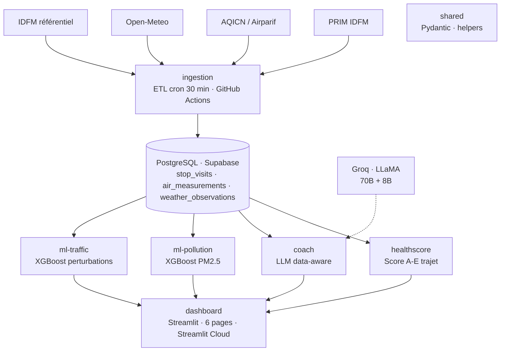

# Architecture ParisMove AI

## Diagramme

```mermaid
flowchart TD
    PRIM[PRIM IDFM] --> ING
    AQICN[AQICN / Airparif] --> ING
    METEO[Open-Meteo] --> ING
    REF[IDFM référentiel] --> ING

    ING["ingestion\nETL cron 30 min · GitHub Actions"]
    ING --> DB

    DB[("PostgreSQL · Supabase\nstop_visits · air_measurements · weather_observations")]

    DB --> HS
    DB --> COACH
    DB --> MLP
    DB --> MLT

    HS["healthscore\nScore A-E trajet"]
    COACH["coach\nLLM data-aware"]
    MLP["ml-pollution\nXGBoost PM2.5"]
    MLT["ml-traffic\nXGBoost perturbations"]
    SHARED["shared\nPydantic · helpers"]

    GROQ["Groq · LLaMA\n70B + 8B"] -.-> COACH

    HS --> DASH
    COACH --> DASH
    MLP --> DASH
    MLT --> DASH

    DASH["dashboard\nStreamlit · 6 pages · Streamlit Cloud"]
```